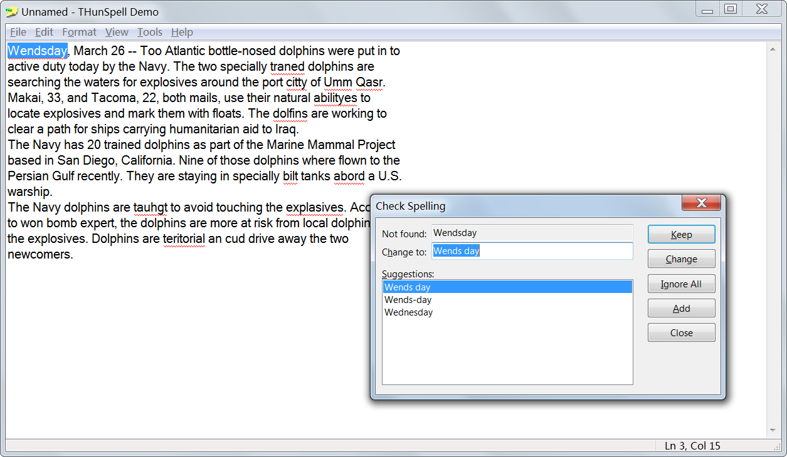

# THunSpell
Delphi hunspell wrapper with a spell check dialog and a red-underline `TMemo` descendent, originally written by Stefan Ascher

# Screenshot

# What I have done so far
- Downloaded the original version of THunSpell by Stefan Ascher from (https://torry.net/authorsmore.php?id=7163),
  the original version is assumed to be developed for Delphi 6 (Non-unicode Delphi).
- Upgraded to unicode Delphi (tested on XE4 only) and the demo is running correctly.
- Re-orgnaized the repository directory (moved all demo-related files to the Demo subfolder).
- Still uses Hunspell DLL version 1.3.2 from year 2011.

# Other spell check libraries/components
**My experiences only**:
- [LS Speller (TSpellChecker)](https://www.luziusschneider.com/SpellerHome.htm): This is the one I used in pre-Unicode Delphi, but it doesn't support Delphi 2009+ and I failed to upgrade it to support Unicode Delphi.
- TMS Spell Checker: I only have the 2017 version and didn't find its spell check dialog directly supporting TRichEdit, and man, it's **not very fast**...
- [NHunspell](https://sourceforge.net/projects/nhunspelldelphi/): Another Hunspell wrapper which uses much newer Hunspell DLL, but it doens't have built-in spell check dialog which can directly operate on a `TCustomMemo` descendent, and that's why I end up upgrading  THunSpell.

# Advantages of THunSpell over the above mentioned alternatives
- It's **fast**!
- Has a `THunSpellDialog` which can direclty check and correct words in a `TMemo`.
- Has a `TMemo`-derived class which draws red lines under words that failed to be validated by Hunspell.

# Possible future enhancements
- Upgrade to the latest Hunspell (try refer to NHunspell mentioned above, I won't do this in the near future unless needed).
- Ensure `THunSpellDialog` supports `TRichEdit`/`TJvRichEdit` (I'll be doing this soon, but will test against `TJvRichEdit` only).
- If you make pull request, try your best **not to break backward compatibilities** (XE4, for example).